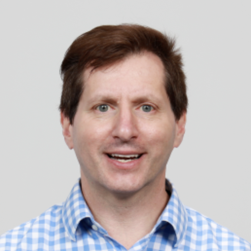

# Keynotes

## Keynote 1: Christian S. Jensen

**TITLE:** Digitalization in the Service of Society: The Case of Big Vehicle Trajectory Data ([slides](./assets/slides/SSDBM_2022_Keynote_Jensen.pdf))

**ABSTRACT:** The ongoing, sweeping digitalization of societal processes generates massive volumes of data that capture the underlying processes at an unprecedented level of detail, in turn enabling us to better understand and improve those processes. Put differently, if harnessed properly, data holds the potential to enable value creation throughout society.

Considering primarily vehicle trajectory data, this talk put focus on the important process of transportation: While we all depend on it for mobility, transportation has adverse effects on our productivity due to lack of predictability and congestion, the climate due to greenhouse gas emissions, and our health and safety due to air and noise pollution and accidents. Thus, it makes good sense to invent techniques capable of leveraging big data for the improvement of transportation.

This talk will describe how the availability of massive trajectory data renders the traditional routing paradigm, where a road network is modeled as an edge-weighted graph, inadequate. Instead, new paradigms that thrive on massive trajectory data are called for. The talk will cover several such paradigms. As even massive volumes of trajectory data are sparse in these settings, the talk will also cover means of making good use of available data. Finally, the talk will cover uses of trajectory data beyond routing.

**BIO:** Christian S. Jensen is Professor of Computer Science at Aalborg University, Denmark. His research concerns analytics, including machine learning, data mining, and query processing, and data management, with a focus on temporal and spatio-temporal data. Christian is an ACM and IEEE Fellow, and he is a member of Academia Europaea, the Royal Danish Academy of Sciences and Letters, and the Danish Academy of Technical Sciences. He has received several awards, most recently the 2022 ACM SIGMOD Contributions Award and the 2019 IEEE TCDE Impact Award. He is on the board of Villum Fonden, a major funder of research in Denmark and is vice-chair of the Danish National Research Foundation. He is president of the steering committee of the Swiss National Research Program on Big Data. In Germany, he is on the scientific advisory board (SAB) of the Max Planck Institute for Informatics; and in Norway, he chairs the SAB of the Norwegian Research Center for AI Innovation.

## Keynote 2: Deb Agarwal

**TITLE:** Applying Data Science in Earth Science to Understand Climate ([slides](./assets/slides/SSDBM_2022_Keynote_Agarwal.pdf))

**ABSTRACT:** A challenge in the earth sciences has been obtaining the data needed to enable study and understanding of ecosystems and climate. Through long-term partnerships between data scientists and earth scientists, our teams have been tackling many aspects of this challenge. Our teams are working on the regional scale (e.g., watersheds and other local ecosystems) and the global scale (e.g., global climate models and global sensor networks) to help build the needed capabilities. Data science needs in the earth sciences occur throughout the lifecycle of the data generated in the field, remote sensing, and by models. Through these partnerships we are also beginning to identify the gaps between earth sciences needs and data science/data management tools available from research and industry. This presentation will discuss some of the things we are doing to address data needs in earth sciences and some of the gaps we have encountered.

**BIO:** Dr. Agarwal's research focuses on scientific tools which enable sharing of scientific experiments, advanced networking infrastructure to support sharing of scientific data, data analysis support infrastructure for eco-science, and cybersecurity infrastructure to secure collaborative environments. Dr. Agarwal is a Research Affiliate at the Berkeley Institute for Data science and an Inria International Chair, where she co-leads the DALHIS (Data Analysis on Large-scale Heterogeneous Infrastructures for Science) Inria Associate team. Dr. Agarwal also leads teams developing data server infrastructure to significantly enhance data browsing and analysis capabilities and enable eco-science synthesis at the watershed-scale to understand hydrologic and conservation questions and at the global-scale to understand carbon flux. Some of the projects Dr. Agarwal is working on include: Enviromental Systems Science Digital Infrastructure for a Virtual Ecosystem (ESS-DIVE), Watershed Function SFA, AmeriFlux Management Project, FLUXNET, NGEE Tropics, International Soil Carbon Network. Dr. Agarwal received her Ph.D. in electrical and computer engineering from University of California, Santa Barbara and a B.S. in Mechanical Engineering from Purdue University.

See <https://dst.lbl.gov/~deba/> for more information.

## Keynote 3: Scott A. Klasky

**TITLE:** The Data Deluge: Overcoming the Barriers to Extreme Scale Science ([slides](./assets/slides/SSDBM_2022_Keynote_Klasky.pdf))

**ABSTRACT:** The rapid growth in technology is providing unprecedented opportunities for scientific inquiry. However, dealing with the data produced has resulted in a crisis. Computer speeds are increasing much faster than are storage technology capacities and I/O rates. This ratio is also getting worse for experimental and observational facilities, where for example, the Legacy Survey of Space and Time (LSST) observatory will collect up to 20 TB per night in 2022, yet the Square Kilometre Array will generate over 2 PB per night in 2028. This reality makes it critical for our community to 1) Create efficient mechanisms to move and store the data in a Findable, Addressable, Interoperable, and Reproducible (FAIR) fashion; 2) Create efficient abstractions so that scientists can perform both online and offline analysis in an efficient fashion; 3) Create new reduction algorithms which can be trusted by the scientific community, and which can allow for new ways to not only reduce/compress the data but also to reduce the memory footprint and the overall time spent in analysis.

To tackle these goals, My group had worked closely with many large-scale applications and researchers to co-design critical software infrastructure for these communities. These research artifacts have been fully integrated into many of the largest simulations and experiments, and have increased the performance of these codes by over 10X. This impact was recognized with an R&D 100 award in 2013 and was highlighted in the 2020 US Department of Energy (DOE) Advanced Scientific Computing Research (ASCR) @40 report. In this presentation, I will discuss the research details on three major contributions I have led: large-scale self-describing parallel I/O (ADIOS), in situ/streaming data (SST), and data refactoring (MGARD). I will introduce the overall concepts and present several results from our research, which has been applied and fully integrated into many of the world's largest scientific applications.

**BIO:** Dr. Scott A. Klasky is a distinguished scientist and the group leader for Workflow Systems in the Computer Science and Mathematics Division at the Oak Ridge National Laboratory. He holds an appointment at the University of Tennessee, and Georgia Tech University. He obtained his Ph.D. in Physics from the University of Texas at Austin (1994). Dr. Klasky is a world expert in scientific computing, scientific data reduction, and scientific data management, co-authoring over 300 papers and is a lead/co-lead of three exascale computing projects: Whole Device Modeling for Fusion, Codesign Center for Online Data Analysis and Reduction and the ADIOS-2 project; three SciDAC projects: High fidelity Boundary  Plasma  Simulation, Integrated Simulation of Energetic Particles in Burning Plasmas, SciDAC Institute for Resource and Application Productivity through computation, Information and Data Science, and the leader of the Sirius-2: Science Driven Data Management for Multitier Storage 2.0 project.

## Keynote 4: Peter Baumann

**TITLE:** The rasdaman Array DBMS: Concepts, Architecture, and What People Do With It ([slides](./assets/slides/SSDBM_2022_Keynote_Baumann.pdf))

**ABSTRACT:** Arrays as a fundamental data category have found their way into the orchestration of data models supported by databases. While OLAP "datacubes" can be emulated relationally to some extent it was in particular applications in science and engineering that have prompted support for arrays regardless of sparsity and with dedicated powerful array operators supporting n-D Tensor Algebra.

The pioneer Array DBMS, rasdaman ("raster data manager"), is a clean-slate DBMS implementation which, based on an algebraic foundation for query language, storage, architecture, and optimization, aiming at large-scale practical use. To satisfy the needs of datacube providers and users solutions had to be found which sometimes are driven by formalized concepts and sometimes by pragmatism, ultimately addressed through a fruitful collaboration of science and industry. Among such challenges addressed are: Novel algorithms for (distributed) array joins; deep support for space and time semantics in geo datacubes which has led to novel data and language concepts meantime adopted as standards; access control on regions within a cube, given the sheer datacube size; automated query splitting in federations of autonomous instances requires combining of global authentication with local authorization; last but not least, combining AI and datacubes is a current topic of active research.

We present the rasdaman Array DBMS in a brief overview and discuss selected challenges, with emphasis on applications in the Earth sciences. Live demos will illustrate our talk.

**BIO:** Dr. Peter Baumann is Professor of Computer Science, inventor, and entrepreneur. At Jacobs University in Bremen, Germany he researches on flexible, scalable services for massive multi-dimensional datacubes and their application in science and engineering. In this field he has published 160+ book chapters, journal, and conference articles and has internationally patented datacube technology. For his continued effort in innovative IT education he was elected Teacher of the Year 2020.

With the rasdaman ("raster data manager") system he has pioneered the research field of Array Databases and technology of Actionable Datacubes. For its commercialization he has founded and leads an internationally successful hitech spinoff, rasdaman GmbH. Today, rasdaman is proven on 70+ Petabyte spatio-temporal datacube federations with more than 1,000-fold parallelization of queries across cloud nodes. Rasdaman continues receiving international innovation awards and recognitions.

Since many years Baumann is critically shaping and often leading datacube standards in ISO, OGC, and the European legal framework for a common SDI, INSPIRE. A particular outcome is the ISO SQL array extension standard 9075:2019 Part 15 which is based on the rasdaman query language.

As a leading scholar in array services he is chair of the IEEE (GRSS) Earth Science Informatics (ESI) Technical Committee, chair of the GAIA-X Earth Observation Expert Group, founding member and chair of CODATA Germany, and Charter Member of Open-Source Geospatial Foundation (OSGeo).

See <https://peter-baumann.org> for more information.
