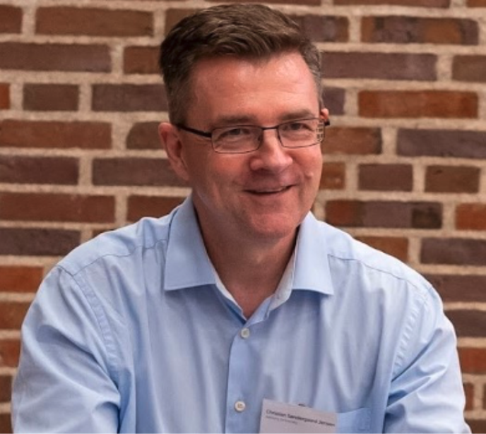

# Keynotes

## Keynote 1: Christian S. Jensen

#### TITLE: TBA

#### ABSTRACT
TBA

#### BIO

## Keynote 2: Deb Agarwal

#### TITLE: Applying Data Science in Earth Science to Understand Climate

#### ABSTRACT

A challenge in the earth sciences has been obtaining the data needed to enable study and understanding of ecosystems and climate. Through long-term partnerships between data scientists and earth scientists, our teams have been tackling many aspects of this challenge. Our teams are working on the regional scale (e.g., watersheds and other local ecosystems) and the global scale (e.g., global climate models and global sensor networks) to help build the needed capabilities. Data science needs in the earth sciences occur throughout the lifecycle of the data generated in the field, remote sensing, and by models. Through these partnerships we are also beginning to identify the gaps between earth sciences needs and data science/data management tools available from research and industry. This presentation will discuss some of the things we are doing to address data needs in earth sciences and some of the gaps we have encountered.

#### BIO

Dr. Agarwal's research focuses on scientific tools which enable sharing of scientific experiments, advanced networking infrastructure to support sharing of scientific data, data analysis support infrastructure for eco-science, and cybersecurity infrastructure to secure collaborative environments. Dr. Agarwal is a Research Affiliate at the Berkeley Institute for Data science and an Inria International Chair, where she co-leads the DALHIS (Data Analysis on Large-scale Heterogeneous Infrastructures for Science) Inria Associate team. Dr. Agarwal also leads teams developing data server infrastructure to significantly enhance data browsing and analysis capabilities and enable eco-science synthesis at the watershed-scale to understand hydrologic and conservation questions and at the global-scale to understand carbon flux. Some of the projects Dr. Agarwal is working on include: Enviromental Systems Science Digital Infrastructure for a Virtual Ecosystem (ESS-DIVE), Watershed Function SFA, AmeriFlux Management Project, FLUXNET, NGEE Tropics, International Soil Carbon Network. Dr. Agarwal received her Ph.D. in electrical and computer engineering from University of California, Santa Barbara and a B.S. in Mechanical Engineering from Purdue University. 

See https://dst.lbl.gov/~deba/ for more information.

## Keynote 3: Peter Baumann

#### TITLE: The rasdaman Array DBMS: Concepts, Architecture, and What People Do With It

#### ABSTRACT

Arrays as a fundamental data category have found their way into the orchestration of data models supported by databases. While OLAP "datacubes" can be emulated relationally to some extent it was in particular applications in science and engineering that have prompted support for arrays regardless of sparsity and with dedicated powerful array operators supporting n-D Tensor Algebra.

The pioneer Array DBMS, rasdaman ("raster data manager"), is a clean-slate DBMS implementation which, based on an algebraic foundation for query language, storage, architecture, and optimization, aiming at large-scale practical use. To satisfy the needs of datacube providers and users solutions had to be found which sometimes are driven by formalized concepts and sometimes by pragmatism, ultimately addressed through a fruitful collaboration of science and industry. Among such challenges addressed are: Novel algorithms for (distributed) array joins; deep support for space and time semantics in geo datacubes which has led to novel data and language concepts meantime adopted as standards; access control on regions within a cube, given the sheer datacube size; automated query splitting in federations of autonomous instances requires combining of global authentication with local authorization; last but not least, combining AI and datacubes is a current topic of active research.

We present the rasdaman Array DBMS in a brief overview and discuss selected challenges, with emphasis on applications in the Earth sciences. Live demos will illustrate our talk.

#### BIO

Dr. Peter Baumann is Professor of Computer Science, inventor, and entrepreneur. At Jacobs University in Bremen, Germany he researches on flexible, scalable services for massive multi-dimensional datacubes and their application in science and engineering. In this field he has published 160+ book chapters, journal, and conference articles and has internationally patented datacube technology. For his continued effort in innovative IT education he was elected Teacher of the Year 2020.

With the rasdaman ("raster data manager") system he has pioneered the research field of Array Databases and technology of Actionable Datacubes. For its commercialization he has founded and leads an internationally successful hitech spinoff, rasdaman GmbH. Today, rasdaman is proven on 70+ Petabyte spatio-temporal datacube federations with more than 1,000-fold parallelization of queries across cloud nodes. Rasdaman continues receiving international innovation awards and recognitions.

Since many years Baumann is critically shaping and often leading datacube standards in ISO, OGC, and the European legal framework for a common SDI, INSPIRE. A particular outcome is the ISO SQL array extension standard 9075:2019 Part 15 which is based on the rasdaman query language.

As a leading scholar in array services he is chair of the IEEE (GRSS) Earth Science Informatics (ESI) Technical Committee, chair of the GAIA-X Earth Observation Expert Group, founding member and chair of CODATA Germany, and Charter Member of Open-Source Geospatial Foundation (OSGeo).

See https://peter-baumann.org for more information.