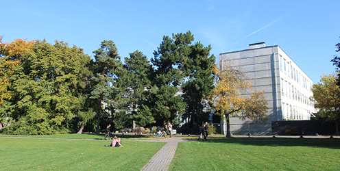
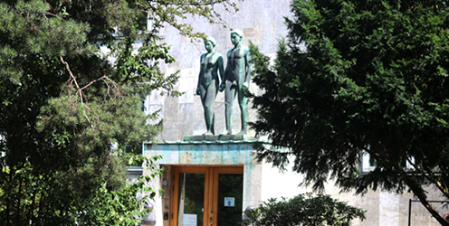
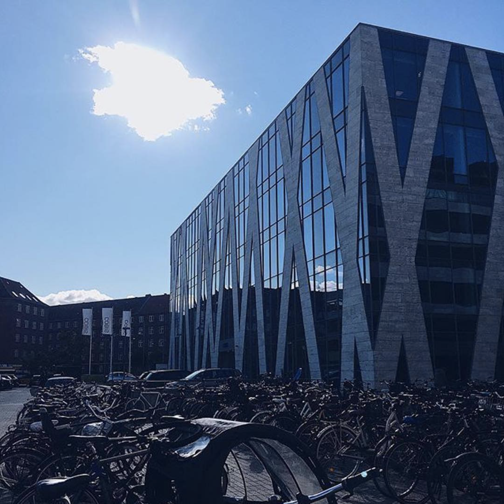
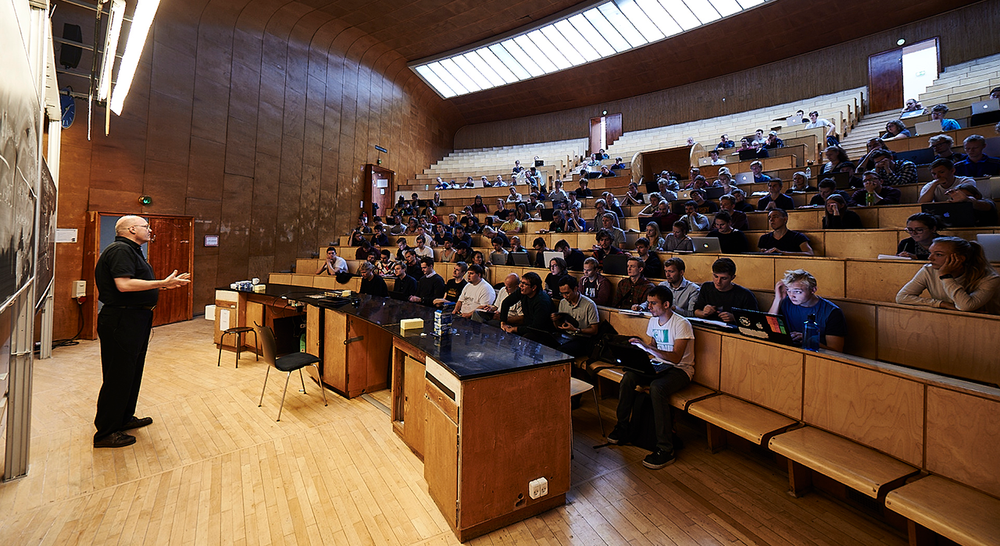

# Conference Venue

## University of Copenhagen

Driven by intellectual creativity and critical thinking since 1479, researchers and students at the University of Copenhagen have expanded horizons and contributed to moving the world forward. With its 5,000 researchers and 37,500 students, the University boasts an international research and study environment and is highly ranked on the leading ranking lists of the world's best universities.

The University offers researchers and students the opportunity to develop their talent and launches ambitious interdisciplinary initiatives to support its strong academic communities. Through research-based teaching – and by involving them in research – students are equipped to address society's challenges and needs.

The University of Copenhagen is working towards becoming one of the world’s greenest campus areas, leaving as little environmental and climate footprint as possible. The University facilitates cross-organisation collaboration, liaises with the business community and helps students find relevant programmes and projects in the field of sustainability.

The University also focuses on gender equality and sees diversity as a strength.

## Department of Computer Science (DIKU)

Department of Computer Science at University of Copenhagen (DIKU) is the first computer science department in Denmark, established by Peter Naur in 1970. Since then, our researchers and graduates have formed the basis for society’s accelerating technological transformation, and our research environment and results have made us one of Europe’s leading and most attractive computer science departments.

## North Campus

Natural science and human life and health are in focus at North Campus, which contains both the Faculty of Science (SCIENCE) and the Faculty of Health and Medical Sciences (SUND). At North Campus, you can visit the Zoological Museum and experience the city from the top of the Mærsk Tower, among other things. Copenhagen's largest, and very popular park, Fælledparken, is within a stone's throw.

North Campus lies in the triangle between Nørre Allé, Jagtvej and Tagensvej. In addition, you can access the Niels Bohr Institute and the Panum Institute via Blegdamsvej.

Address: Univeristetsparken 5, 2100 Copenhagen